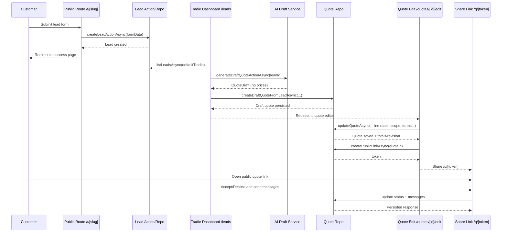

# TradeFlow Architecture

This document describes the current MVP architecture for the TradeFlow app.

## Product Intent

TradeFlow is a single-tradie quoting workflow:

1. Customer submits a lead from a public form.
2. Tradie reviews leads in dashboard.
3. Tradie generates an AI-assisted draft quote (no pricing guessed by AI).
4. Tradie edits scope, exclusions, terms, and line item pricing.
5. Tradie shares a public quote link.
6. Customer accepts/declines and can message back.

## Stack

- Next.js App Router (server components + server actions)
- TypeScript
- Tailwind CSS
- Prisma ORM
- Postgres (Supabase)
- Optional OpenAI integration (falls back to deterministic stub)

## Top-Level Architecture

### Presentation Layer

- Routes in `app/*`
- Form/UI components in `src/features/*/components`

### Application Layer

- Server actions in `src/features/*/actions`
- Input mapping/parsing in `src/core/*`

### Domain/Core Layer

- Validation schemas (Zod) in `src/core/*`
- Quote math and draft schemas in `src/core/quotes`, `src/core/ai`

### Data Access Layer

- Prisma repositories in `src/features/*/repo`
- Shared Prisma client in `src/db/prisma.ts`

## Main Data Models

Defined in `prisma/schema.prisma`:

- `TradieProfile`: single-tradie profile/config
- `Lead`: inbound customer request
- `Quote`: quote header, totals, status, revision metadata
- `QuoteLine`: line items
- `QuotePublicLink`: customer tokenized quote access
- `QuoteMessage`: customer/tradie/system conversation
- `QuoteRevision`: snapshots of quote changes
- `RateMemory`, `RateSample`: historical pricing memory/suggestions

## Route to Action to Repo Map

- `/` -> redirect to `/quotes`
- `/t/[slug]` -> `createLeadActionAsync` -> `createLeadAsync`
- `/t/[slug]/success` -> confirmation page
- `/leads` -> `listLeadsAsync`
- `/leads/[id]` -> `getLeadByIdAsync`
- `Generate draft` button -> `generateDraftQuoteActionAsync` ->
  - `getQuoteDraftService().draftQuoteAsync(...)`
  - `createDraftQuoteFromLeadAsync(...)`
  - `updateLeadStatusAsync(..., "QUOTED")`
- `/quotes` -> `listQuotesAsync`
- `/quotes/new` -> `createQuoteActionAsync` -> `createQuoteAsync`
- `/quotes/[id]` -> `getQuoteByIdAsync`
- `/quotes/[id]/edit` ->
  - save: `updateQuoteActionAsync` -> `updateQuoteAsync`
  - share link: `createPublicLinkActionAsync` -> `createPublicLinkAsync`
  - tradie message: `sendTradieMessageActionAsync` -> `createMessageAsync`
- `/q/[token]` -> `getQuoteByTokenAsync`
  - accept: `acceptQuoteActionAsync`
  - decline: `declineQuoteActionAsync`
  - customer message: `sendCustomerMessageActionAsync`
- `/tradie` -> `upsertDefaultTradieActionAsync` -> `upsertDefaultTradieAsync`

## Core Workflow Sequence

## AI Drafting Behavior

- Service selector: `src/services/ai/quoteDraftService.ts`
- Uses OpenAI only when `OPENAI_API_KEY` is present.
- Otherwise uses deterministic stub drafts.
- Draft schema enforced in `src/core/ai/quoteDraftSchemas.ts`.
- Draft output includes scope/exclusions/line item skeletons, not prices.

## Pricing and Totals

- Line totals and quote totals are computed in `src/core/quotes/quoteCalculator.ts`.
- Final quote totals are persisted server-side in repo methods.
- Rate memory/suggestions come from:
  - `src/features/rates/repo/rateMemoryRepo.ts`
  - `src/core/rates/rateSuggestion.ts`

## Current MVP Constraints

- No authentication/authorization (single-tradie mode).
- No PDF generation yet (HTML quote renderer only).
- Public token links are the customer entry point.
- Messaging is quote-scoped and locked after acceptance.
